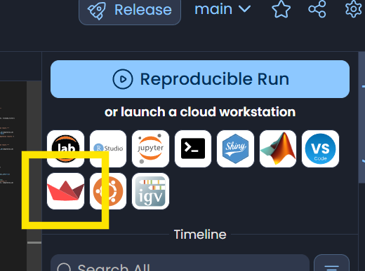
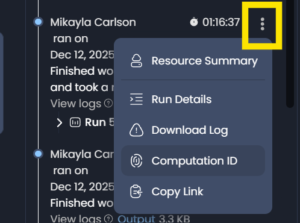

# aind-ibl-ephys-channel-locations-to-docdb

**under development! Currently for DR users only**

## Usage
 
- get the Computation ID from a previous IBL GUI run (which contains a subject ID folder with json files)

- launch the streamlit app (no need to duplicate) - you should be prompted to add S3 assumable role and Code Ocean API Key (let Ben know if you don't have that set up already!)

- paste the ID in the streamlit app and you should get a table of existing and new files. You can then select new files their contents "to docdb"
(currently the docdb editing isn't implemented so they just go to the S3 scratch data bucket for easier pickup for other tools, and docdb ingestion at a later date)

